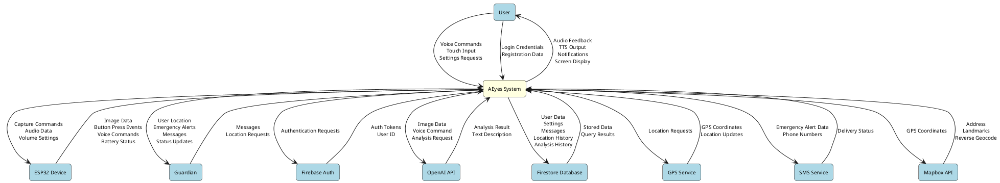
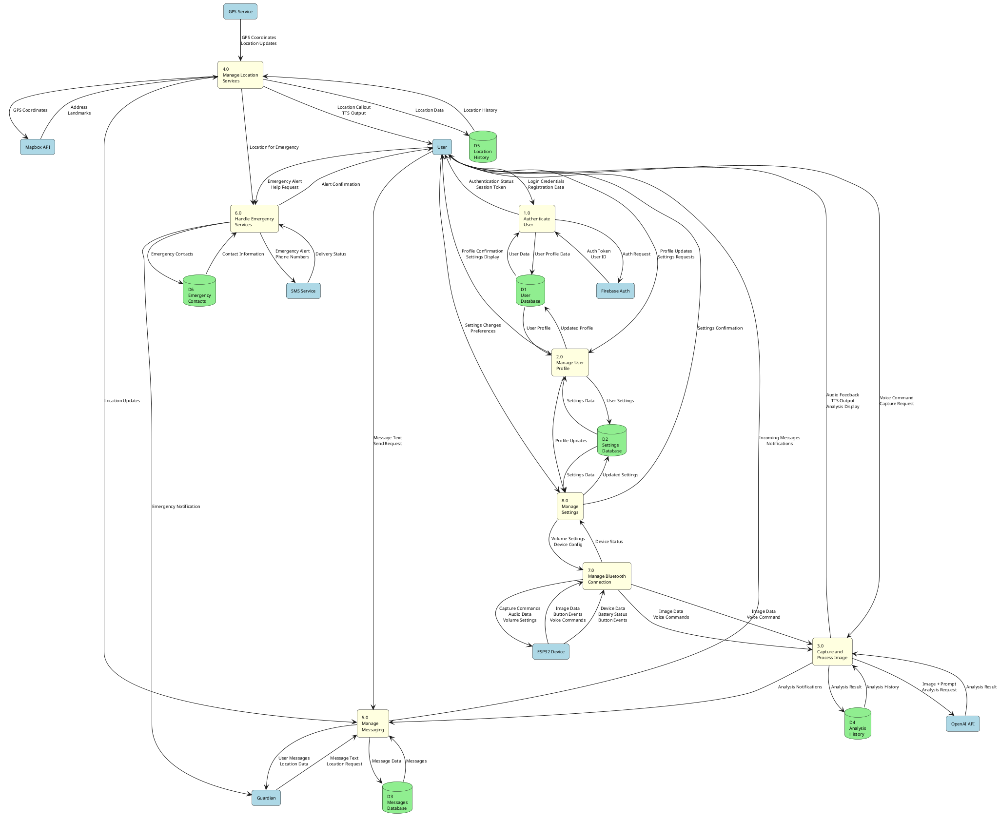

# Data Flow Diagram (DFD) Documentation
## AEyes - Wearable Assistive System for Visually Impaired Users

**Document Version:** 1.0  
**Date:** 2024  
**Project:** AEyes System

---

## 1. Definition of Data Flow Diagram (DFD)

A **Data Flow Diagram (DFD)** is a graphical representation of the flow of data through an information system. It illustrates how data moves from external entities (sources and destinations) through processes (functions that transform data) and data stores (repositories where data is held). DFDs are used to model the logical flow of data in a system, showing what processes exist, what data they use, and how data flows between them.

DFDs are particularly useful for:
- Understanding system requirements and functionality
- Documenting system architecture at different levels of abstraction
- Identifying data dependencies and relationships
- Communicating system design to stakeholders
- Identifying potential bottlenecks or inefficiencies in data flow

---

## 2. How DFD Was Used in This Study

In the AEyes system study, DFDs were used to:

1. **System Analysis**: To understand and document how data flows through the entire AEyes assistive system, from user interactions to external services and back.

2. **Architecture Documentation**: To provide a clear visual representation of the system's architecture, showing how different components (mobile app, ESP32 device, cloud services) interact and exchange data.

3. **Process Identification**: To identify and document all major processes within the system, including:
   - User authentication and registration
   - Image capture and AI analysis
   - Location tracking and GPS callouts
   - Messaging between users and guardians
   - Emergency alert systems
   - Settings management

4. **Data Flow Validation**: To ensure that all data flows are properly defined and that no processes are missing critical data inputs or outputs.

5. **Integration Planning**: To understand how external entities (ESP32 device, Firebase, OpenAI API, GPS services) integrate with the mobile application and what data needs to be exchanged.

6. **System Design Verification**: To verify that the implemented system matches the intended design and that all data flows are correctly implemented.

---

## 3. DFD Notations Used

This study uses the **Gane-Sarson notation** (also known as the "Yourdon-DeMarco" style), which includes the following symbols:

### 3.1 External Entities (Sources/Sinks)
- **Symbol**: Rectangle with rounded corners
- **Purpose**: Represents external sources or destinations of data that are outside the system boundary
- **Examples**: User, ESP32 Device, Guardian, Firebase Auth, OpenAI API, GPS Service

### 3.2 Processes
- **Symbol**: Rounded rectangle (bubble)
- **Purpose**: Represents a function or transformation that processes data
- **Labeling**: Process name and number (e.g., "1.0 Authenticate User")
- **Examples**: "Process Image", "Manage Settings", "Handle Emergency"

### 3.3 Data Stores
- **Symbol**: Open rectangle (two parallel lines, open on right side)
- **Purpose**: Represents a repository where data is stored
- **Labeling**: "D" followed by a number (e.g., "D1 User Database")
- **Examples**: D1 User Database, D2 Settings Database, D3 Messages Database

### 3.4 Data Flows
- **Symbol**: Arrow with label
- **Purpose**: Represents the movement of data between processes, data stores, and external entities
- **Labeling**: Descriptive name of the data being transferred
- **Examples**: "User Credentials", "Image Data", "Analysis Result", "Location Data"

### 3.5 Data Flow Rules
- Data flows are unidirectional (one direction only)
- Data flows must have meaningful labels
- Data flows cannot go directly from one data store to another (must go through a process)
- Data flows cannot go directly from one external entity to another (must go through a process)
- Processes must have at least one input and one output data flow

---

## 4. Context Diagram (Level 0 DFD)

The **Context Diagram** is the highest level DFD and shows the entire system as a single process, along with all external entities that interact with it. It establishes the system boundary and identifies all external interfaces.

### Context Diagram Description

The AEyes system (represented as a single process) interacts with the following external entities:

1. **User**: The visually impaired person using the system
2. **ESP32 Device**: The smart glasses hardware with camera, microphone, and bone conduction speaker
3. **Guardian**: Family members or caregivers who monitor the user
4. **Firebase Authentication**: Cloud authentication service for user login/registration
5. **OpenAI API**: Cloud service for image analysis using GPT-4 Vision
6. **Firestore Database**: Cloud database for storing user data, settings, messages, and history
7. **GPS Service**: Device location service for navigation and location callouts
8. **SMS Service**: Mobile service for sending emergency alerts
9. **Mapbox API**: Geocoding service for reverse geocoding GPS coordinates to addresses

### PlantUML Code for Context Diagram

---

## 5. Level 1 DFD

The **Level 1 DFD** decomposes the single process from the Context Diagram into major sub-processes. It shows the main functional areas of the system and how data flows between them.

### Level 1 Processes

1. **1.0 Authenticate User**: Handles user login, registration, and authentication
2. **2.0 Manage User Profile**: Manages user profile information and settings
3. **3.0 Capture and Process Image**: Handles image capture from ESP32 and AI analysis
4. **4.0 Manage Location Services**: Handles GPS tracking and location callouts
5. **5.0 Manage Messaging**: Handles communication between users and guardians
6. **6.0 Handle Emergency Services**: Manages emergency alerts and SMS notifications
7. **7.0 Manage Bluetooth Connection**: Handles ESP32 device connection and communication
8. **8.0 Manage Settings**: Handles application settings and preferences

### Data Stores

- **D1 User Database**: Stores user profiles, authentication data
- **D2 Settings Database**: Stores user preferences and configuration
- **D3 Messages Database**: Stores messages between users and guardians
- **D4 Analysis History**: Stores image analysis results and history
- **D5 Location History**: Stores GPS coordinates and location data
- **D6 Emergency Contacts**: Stores emergency contact information

### PlantUML Code for Level 1 DFD

---

## 6. Key Data Flows Explained

### 6.1 Image Capture and Analysis Flow
1. User provides voice command or presses button
2. ESP32 captures image and sends via Bluetooth
3. System receives image and voice command
4. Image and prompt sent to OpenAI API
5. Analysis result received and stored
6. Result converted to speech and played to user

### 6.2 Location Services Flow
1. GPS Service provides coordinates
2. Coordinates sent to Mapbox for reverse geocoding
3. Address/landmark information received
4. Location data stored in database
5. Location callout converted to speech
6. Audio feedback provided to user

### 6.3 Messaging Flow
1. User or Guardian sends message
2. Message stored in Firestore database
3. Recipient notified of new message
4. Message retrieved and displayed
5. Real-time updates via Firestore listeners

### 6.4 Emergency Services Flow
1. User triggers emergency alert
2. System retrieves emergency contacts
3. Location data retrieved
4. SMS alerts sent to contacts
5. Guardian notified via app
6. Confirmation provided to user

---

## 7. Data Dictionary (Key Data Flows)

| Data Flow Name | Description | Source | Destination | Data Elements |
|---------------|-------------|--------|-------------|---------------|
| Login Credentials | User authentication data | User | Process 1.0 | Email, Password |
| Auth Token | Authentication token | Firebase Auth | Process 1.0 | JWT Token, User ID |
| Image Data | Captured image bytes | ESP32 | Process 7.0 | JPEG/PNG bytes, Timestamp |
| Voice Command | Spoken command text | ESP32/User | Process 3.0 | Text string, Timestamp |
| Analysis Request | Image and prompt for analysis | Process 3.0 | OpenAI API | Image bytes, Prompt text |
| Analysis Result | AI-generated description | OpenAI API | Process 3.0 | Text description, Confidence |
| GPS Coordinates | Location data | GPS Service | Process 4.0 | Latitude, Longitude, Accuracy |
| Address | Reverse geocoded address | Mapbox API | Process 4.0 | Street, City, Landmarks |
| Message Data | Text message content | User/Guardian | Process 5.0 | Sender ID, Text, Timestamp |
| Emergency Alert | Emergency notification data | Process 6.0 | SMS Service | Phone numbers, Message, Location |
| Settings Data | User preferences | Process 8.0 | D2 | TTS Volume, Language, Detection Mode |
| User Profile | User information | Process 2.0 | D1 | User ID, Name, Email, Address |

---

## 8. Conclusion

The Data Flow Diagrams provide a comprehensive view of the AEyes system's architecture, showing how data flows from external entities through various processes and data stores. The Context Diagram establishes the system boundary and external interfaces, while the Level 1 DFD decomposes the system into major functional processes.

These diagrams serve as:
- **Documentation**: Clear visual representation of system architecture
- **Communication Tool**: Helps stakeholders understand system design
- **Design Validation**: Ensures all data flows are properly defined
- **Implementation Guide**: Assists developers in understanding system requirements

The use of standard DFD notations (Gane-Sarson) ensures consistency and clarity, making the diagrams easily understandable to both technical and non-technical stakeholders.

---

## 9. Ready-to-Use Paragraph Text for Documentation

### Paragraph: Definition and Usage of DFD in AEyes Study

A Data Flow Diagram (DFD) is a graphical representation that illustrates the flow of data through an information system, showing how data moves from external entities through processes and data stores. In this study, DFDs were employed to document and analyze the AEyes wearable assistive system architecture. The study utilized the Gane-Sarson notation, which includes four primary symbols: external entities (rounded rectangles representing sources and destinations outside the system), processes (rounded rectangles representing data transformations), data stores (open rectangles representing data repositories), and data flows (labeled arrows showing data movement). The DFD analysis began with a Context Diagram (Level 0 DFD) that established the system boundary and identified all external interfaces, including the User, ESP32 Device, Guardian, Firebase Authentication, OpenAI API, Firestore Database, GPS Service, SMS Service, and Mapbox API. This was followed by a Level 1 DFD that decomposed the system into eight major processes: (1) Authenticate User, (2) Manage User Profile, (3) Capture and Process Image, (4) Manage Location Services, (5) Manage Messaging, (6) Handle Emergency Services, (7) Manage Bluetooth Connection, and (8) Manage Settings. The DFDs also identified six data stores: User Database, Settings Database, Messages Database, Analysis History, Location History, and Emergency Contacts. These diagrams served multiple purposes: documenting system architecture, identifying data dependencies, validating data flows, planning external service integrations, and verifying that the implemented system matched the intended design. The diagrams were created using PlantUML, a text-based diagramming tool that generates scalable, high-quality diagrams suitable for academic documentation, ensuring readability and proper formatting regardless of document size requirements.

---

## 10. Notes on Diagram Generation

To generate the diagrams from the PlantUML code provided above:

1. **Online Tool**: Use [PlantUML Online Server](http://www.plantuml.com/plantuml/uml/) or [PlantText](https://www.planttext.com/)
   - Copy the PlantUML code from the sections above
   - Paste into the online editor
   - Click "Generate" to create the diagram
   - Export as PNG, SVG, or PDF

2. **VS Code Extension**: Install "PlantUML" extension in VS Code
   - Install the extension from the marketplace
   - Create a `.puml` file with the code
   - Right-click and select "Preview Current Diagram"
   - Export the diagram

3. **Local Installation**: Install PlantUML Java application locally
   - Download PlantUML from [plantuml.com](http://plantuml.com/)
   - Requires Java runtime environment
   - Use command line or GUI to generate diagrams

4. **Export Options**: 
   - PNG format for documents (recommended for readability)
   - SVG format for scalable vector graphics
   - PDF format for high-quality printing

The PlantUML code can be copied directly into any PlantUML-compatible tool to generate high-quality, readable diagrams that can be scaled to any size needed for documentation purposes. The diagrams will be properly formatted with appropriate colors, shapes, and labels according to standard DFD notation conventions.

